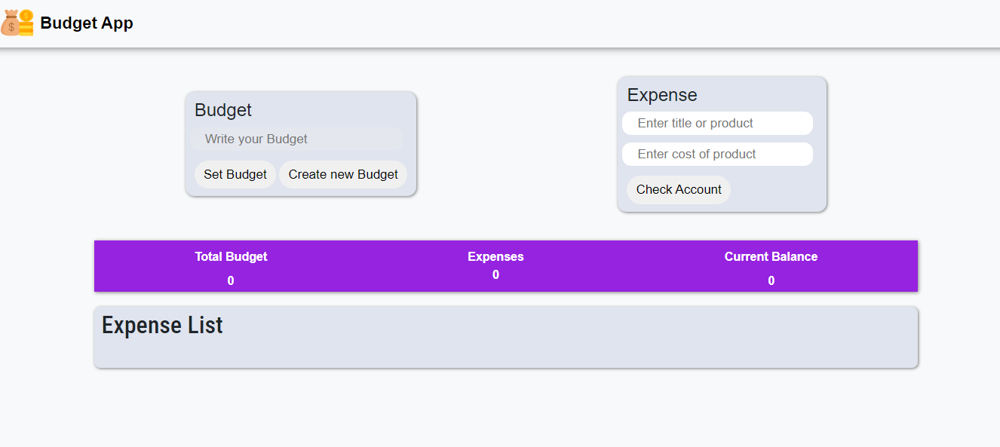
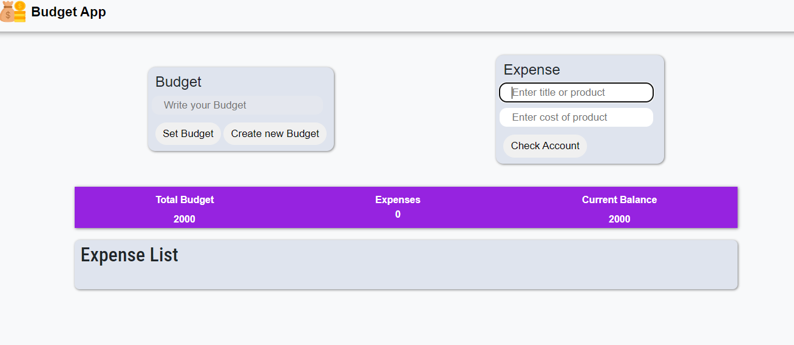
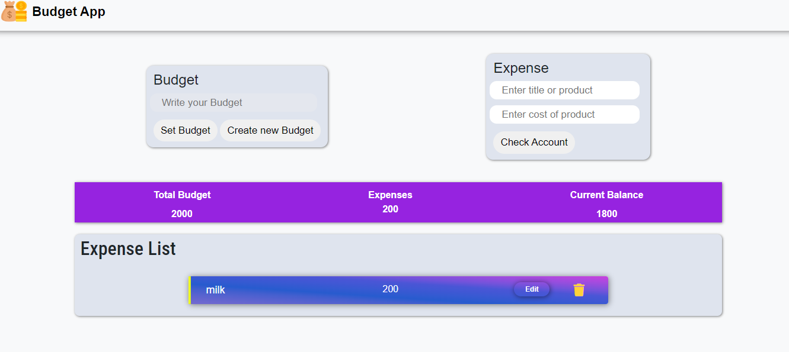
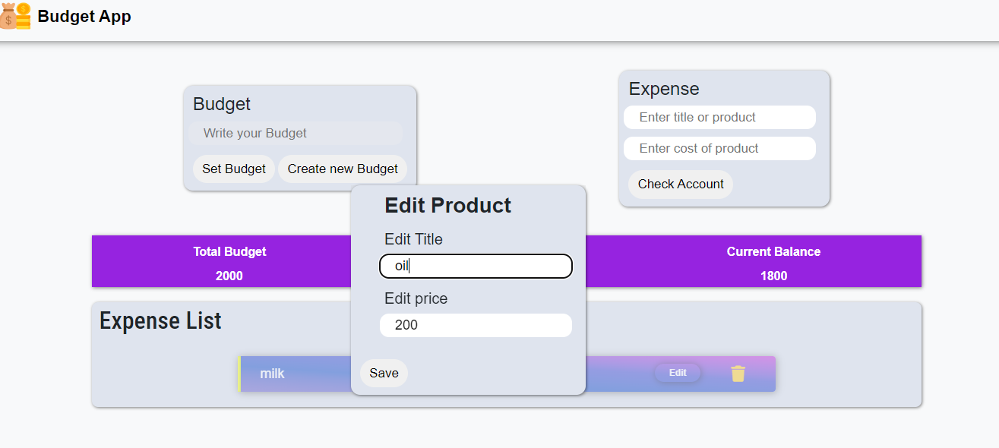

# Budget App: Your Financial Companion

Introducing **Budget App**, a sleek and intuitive tool designed to simplify your monthly expense tracking and budgeting. Whether you're managing household finances or personal spending, Budget App ensures you stay on top of your financial game with ease and efficiency.

1. **First Interface**:
   

## Key Features

- **Add Expenses** 📝: Seamlessly add your monthly expenses along with product names and prices. Categorize and organize your spending to get a clear picture of your financial habits.
  
- **Edit Entries** ✏️: Flexibility is key! Edit the names and prices of your entries at any time, ensuring your budget is always accurate and up-to-date.

- **Delete Entries** 🗑️: Keep your budget clutter-free by easily deleting any unnecessary or outdated entries.

- **Optimized for Performance** 🚀: Budget App is designed with performance in mind, ensuring a smooth and responsive experience even with a large number of entries.

## Screenshots

2. **Add Budget**:
   

3. **Add Expense**:
   

4. **Edit Expense**:
   

## Why Choose Budget App?

- **User-Friendly Interface** 🎨: Navigate through your expenses effortlessly with an intuitive and beautiful interface.
- **Real-Time Updates** ⏱️: Instantly see the impact of your changes on your overall budget.
- **Customization** ⚙️: Tailor your budgeting experience to suit your unique needs with the ability to edit and manage entries.

Take control of your finances with Budget App – where managing your money is made simple, efficient, and visually appealing.
